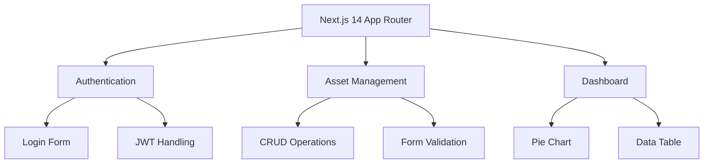
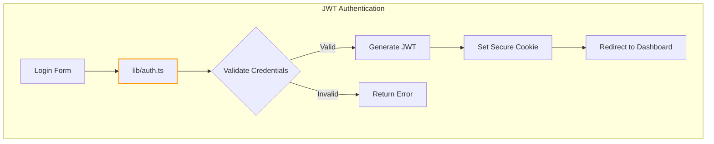

# System Architecture

## App Structure

## Authentication Flow

- Core JWT logic implemented in `lib/auth.ts`
- Session cookies use `SameSite: "strict"` for CSRF protection
- Token validation checks user existence in the database
- Redirects to dashboard after successful login/register

## Key Patterns
1. Server Components for initial page loads
2. Client-side interactivity with React hooks
3. Modular component library (shadcn/ui)
4. Type-safe API interactions via lib/types.ts
5. Secure session management (SameSite cookies, user existence validation)
6. Redirect handling after authentication
7. API endpoints require authentication (returns 401 if not authenticated)
8. Asset creation (POST /api/assets) now includes `purchaseDate` and `notes` fields
9. Zod validation for asset creation and editing:
   - Zod schemas defined in `lib/validation.ts`
   - API endpoints (e.g., `app/api/assets/route.ts`) validate request bodies with Zod and return 400 on validation failure
   - Asset forms (`components/add-asset-form.tsx`, `components/edit-asset-form.tsx`) use react-hook-form with zodResolver for real-time validation feedback

## Data Models

- **Asset** (see `lib/schema.ts`):
  - id: number
  - name: string
  - type: string (categorical)
  - amount: numeric (precision 20, scale 8)
  - avg_pricing: numeric (precision 20, scale 8)
  - current_pricing: numeric (precision 20, scale 8)
  - unit: string
  - userId: number (foreign key to users)
  - purchaseDate: timestamp
  - notes: string (optional)
  - createdAt: timestamp
  - updatedAt: timestamp

- **User** (see `lib/schema.ts`):
  - id: number
  - email: string (unique)
  - name: string
  - passwordHash: string
  - createdAt: timestamp
  - updatedAt: timestamp

## Critical Paths
- app/login/page.tsx → lib/auth.ts
- app/assets/add/page.tsx → lib/assets.ts
- components/assets-pie-chart.tsx → lib/utils.ts
