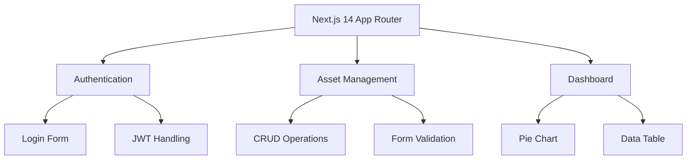

# System Architecture

## App Structure

## Key Patterns
1. Server Components for initial page loads
2. Client-side interactivity with React hooks
3. Modular component library (shadcn/ui)
4. Type-safe API interactions via lib/types.ts

## Critical Paths
- app/login/page.tsx → lib/auth.ts
- app/assets/add/page.tsx → lib/assets.ts
- components/assets-pie-chart.tsx → lib/utils.ts
