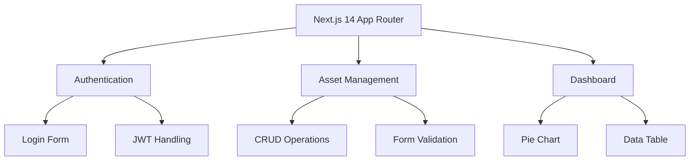
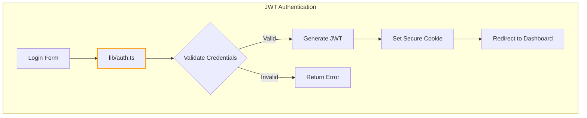

# System Architecture

## App Structure

## Authentication Flow

- Core JWT logic implemented in `lib/auth.ts`
- Session cookies use `SameSite: "strict"` for CSRF protection
- Token validation checks user existence in the database
- Redirects to dashboard after successful login/register

## Key Patterns
1. Server Components for initial page loads
2. Client-side interactivity with React hooks
3. Modular component library (shadcn/ui)
4. Type-safe API interactions via lib/types.ts
5. Secure session management (SameSite cookies, user existence validation)
6. Redirect handling after authentication

## Data Models

- **Asset** (see `lib/types.ts`):
  - id: string
  - userId: string
  - name: string
  - type: "Stock" | "Crypto" | "Cash" | "Gold" | "Other"
  - amount: number
  - avg_pricing: number
  - current_pricing: number
  - unit: "USD" | "VND"
  - purchaseDate: string
  - notes?: string
  - createdAt: string
  - updatedAt: string

- **User** (see `lib/types.ts`):
  - id: string
  - name: string
  - email: string

## Critical Paths
- app/login/page.tsx → lib/auth.ts
- app/assets/add/page.tsx → lib/assets.ts
- components/assets-pie-chart.tsx → lib/utils.ts
